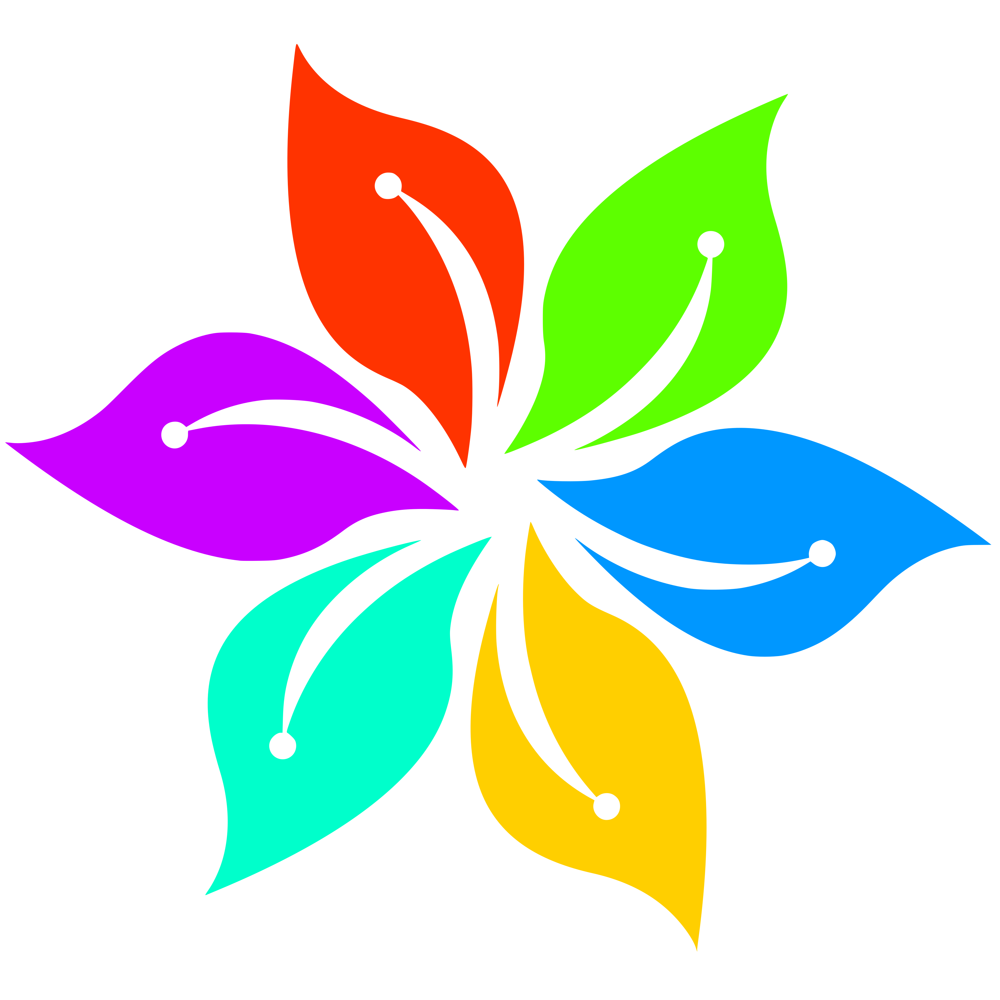

# Pigment

A modern, header-only C++20 library for comprehensive color manipulation, conversion, and analysis.

[]()
[]()
[]()

## Features

- 🎨 **Multiple Color Spaces**: RGB, HSL, HSV, LAB, and Monochrome support
- 🔄 **Seamless Conversions**: Convert between any color spaces with high precision
- 🎭 **Color Harmonies**: Generate complementary, triadic, analogous, and other color schemes
- 🎨 **Color Palettes**: Create and manipulate color palettes with predefined schemes
- ♿ **Accessibility**: WCAG contrast ratio calculations and accessibility level checking
- 🌈 **Color Blindness**: Simulate different types of color vision deficiencies
- 🧮 **Mathematical Operations**: Add, subtract, mix, and scale colors
- 🔍 **Color Analysis**: Luminance, brightness, warmth, and perceptual difference calculations
- ⚡ **High Performance**: Header-only, optimized for speed and memory efficiency
- 🧪 **Thoroughly Tested**: Comprehensive test suite with 8000+ assertions

## Installation

### CMake (Recommended)

```cmake
include(FetchContent)
FetchContent_Declare(
  pigment
  GIT_REPOSITORY https://github.com/bresilla/pigment.git
  GIT_TAG        main
)
FetchContent_MakeAvailable(pigment)

target_link_libraries(your_target PRIVATE pigment::pigment)
```

### Manual Installation

```bash
git clone https://github.com/bresilla/pigment.git
cd pigment
mkdir build && cd build
cmake ..
make install
```

## Quick Start

```cpp
#include <pigment/pigment.hpp>
using namespace pigment;

// Create colors in different formats
RGB red(255, 0, 0);
RGB blue("#0000FF");
HSL cyan(180.0, 1.0, 0.5);
LAB lab(50.0, 20.0, -30.0);

// Convert between color spaces
HSL red_hsl = HSL::fromRGB(red);
RGB cyan_rgb = cyan.to_rgb();

// Color operations
RGB purple = red.mix(blue, 0.5);
RGB darker_red = red.darken(0.2);
RGB warmer_red = red.warm(0.1);

// Generate color palettes
auto gradient = Palette::gradient(red, blue, 10);
auto material_colors = Palette::material_design();
auto harmonious = Palette::analogous(red, 5);

// Accessibility and analysis
double contrast = utils::contrast_ratio(red, RGB::white());
auto accessibility_level = utils::check_accessibility(red, RGB::white());
bool is_light = red.is_light();
```

## Color Types

### RGB (Red, Green, Blue)
```cpp
// Construction
RGB color1(255, 128, 64);          // From values
RGB color2("#FF8040");             // From hex string
RGB color3("#F84");                // Short hex format
RGB color4("FF8040");              // Hex without #
RGB transparent(255, 0, 0, 128);   // With alpha channel

// Operations
std::string hex = color1.to_hex();           // Convert to hex
RGB mixed = color1.mix(color2, 0.3);         // Mix colors
RGB sum = color1 + color2;                   // Add colors
RGB scaled = color1 * 0.5;                   // Scale brightness
RGB inverted = color1.invert();              // Invert colors
RGB grayscale = color1.to_grayscale();       // Convert to grayscale

// Analysis
double luminance = color1.luminance();       // Calculate luminance
bool is_light = color1.is_light();           // Check if light/dark
RGB contrasted = color1.adjust_contrast(0.5);
```

### HSL (Hue, Saturation, Lightness)
```cpp
// Construction and conversion
HSL hsl(240.0, 0.8, 0.6);              // Hue in degrees, S&L in [0,1]
HSL from_rgb = HSL::fromRGB(RGB::red());
RGB back_to_rgb = hsl.to_rgb();

// Adjustments
HSL lighter = hsl.lighten(0.2);         // Increase lightness
HSL more_saturated = hsl.saturate(0.1); // Increase saturation
HSL hue_shifted = hsl.adjust_hue(30.0); // Shift hue by degrees

// Color harmonies
HSL complement = hsl.complement();       // Complementary color
auto triadic = hsl.triadic();           // Triadic harmony (3 colors)
auto analogous = hsl.analogous();       // Analogous colors
auto split_comp = hsl.split_complementary(); // Split complementary
```

### HSV (Hue, Saturation, Value)
```cpp
// Construction and conversion
HSV hsv(120.0f, 0.7f, 0.9f);
HSV from_rgb = HSV::fromRGB(RGB::green());
RGB to_rgb = hsv.toRGB();

// Adjustments (modifies in-place)
hsv.adjustBrightness(0.1f);    // Increase brightness
hsv.adjustSaturation(-0.2f);   // Decrease saturation
```

### LAB (Perceptually Uniform Color Space)
```cpp
// Construction and conversion
LAB lab(70.0, 20.0, -10.0);        // L: [0,100], a&b: [-128,127]
LAB from_rgb = LAB::fromRGB(RGB::blue());
RGB to_rgb = lab.to_rgb();

// Perceptual operations
double delta_e = lab1.delta_e(lab2);        // Perceptual difference
bool similar = lab1.is_similar(lab2, 5.0);  // Within threshold
LAB mixed = lab1.mix(lab2, 0.5);            // Perceptual mixing
LAB lighter = lab.adjust_lightness(10.0);   // Adjust lightness
```

### MONO (Monochrome/Grayscale)
```cpp
MONO gray(128);                 // 8-bit grayscale value
MONO black = MONO::black();     // Pure black (0)
MONO white = MONO::white();     // Pure white (255)
MONO mid_gray = MONO::gray();   // Middle gray (128)
```

## Color Palettes

### Creating Palettes
```cpp
// Empty palette
Palette palette;
palette.add(RGB::red());
palette.add({RGB::green(), RGB::blue()});

// From vector
std::vector<RGB> colors = {RGB::red(), RGB::green(), RGB::blue()};
Palette palette(colors);

// Generate gradients
auto gradient = Palette::gradient(RGB::red(), RGB::blue(), 10);
```

### Predefined Palettes
```cpp
auto material = Palette::material_design();     // 16 Material Design colors
auto warm_palette = Palette::warm();             // 5 warm colors
auto cool_palette = Palette::cool();             // 5 cool colors
auto monochromatic = Palette::monochromatic(RGB::red(), 7);
auto analogous = Palette::analogous(RGB::blue(), 5);
auto complementary = Palette::complementary(RGB::green());
```

### Palette Operations
```cpp
size_t count = palette.size();
bool empty = palette.empty();
RGB first_color = palette[0];
auto hex_strings = palette.to_hex();
palette.clear();
```

## Utility Functions

### Accessibility
```cpp
// Contrast ratios (WCAG standards)
double contrast = utils::contrast_ratio(foreground, background);

// Accessibility levels
auto level = utils::check_accessibility(text_color, bg_color);
// Returns: AA_NORMAL, AA_LARGE, AAA_NORMAL, AAA_LARGE, or FAIL

// Best contrast color
RGB best = utils::best_contrast_color(background_color);
```

### Color Analysis
```cpp
// Color temperature
bool is_warm = utils::is_warm_color(color);
double temperature = utils::color_temperature(color);

// Color distance
double distance = utils::color_distance(color1, color2);

// Sorting
std::vector<RGB> colors = {/*...*/};
utils::sort_by_hue(colors);
utils::sort_by_brightness(colors);
```

### Color Harmonies
```cpp
auto complementary = utils::generate_harmony(base_color, "complementary");
auto triadic = utils::generate_harmony(base_color, "triadic");
auto analogous = utils::generate_harmony(base_color, "analogous");
auto tetradic = utils::generate_harmony(base_color, "tetradic");
```

### Color Blindness Simulation
```cpp
RGB original(255, 100, 50);

// Simulate different types of color blindness
RGB protanopia = utils::ColorBlindness::simulate(original, utils::ColorBlindness::PROTANOPIA);
RGB deuteranopia = utils::ColorBlindness::simulate(original, utils::ColorBlindness::DEUTERANOPIA);
RGB tritanopia = utils::ColorBlindness::simulate(original, utils::ColorBlindness::TRITANOPIA);

// Simulate color vision anomalies (partial color blindness)
RGB protanomaly = utils::ColorBlindness::simulate(original, utils::ColorBlindness::PROTANOMALY);
RGB deuteranomaly = utils::ColorBlindness::simulate(original, utils::ColorBlindness::DEUTERANOMALY);
RGB tritanomaly = utils::ColorBlindness::simulate(original, utils::ColorBlindness::TRITANOMALY);
```

### Palette Quantization
```cpp
std::vector<RGB> image_colors = {/*...*/};
std::vector<RGB> palette = {RGB::red(), RGB::green(), RGB::blue()};

// Map image colors to closest palette colors
auto quantized = utils::quantize_to_palette(image_colors, palette);
```

## Building and Testing

### Build Examples
```bash
git clone https://github.com/bresilla/pigment.git
cd pigment
make compile  # Configure with examples and tests
make build    # Build everything
make test     # Run test suite
```

### Build Options
```bash
# Build with examples
cmake -DPIGMENT_BUILD_EXAMPLES=ON ..

# Build with tests
cmake -DPIGMENT_ENABLE_TESTS=ON ..

# Both
cmake -DPIGMENT_BUILD_EXAMPLES=ON -DPIGMENT_ENABLE_TESTS=ON ..
```

## Test Coverage

The library includes comprehensive tests covering:

- **RGB Tests**: Construction, hex conversion, arithmetic operations, predefined colors
- **HSL Tests**: Conversion accuracy, color adjustments, harmony generation
- **HSV Tests**: Construction, RGB conversion, brightness/saturation adjustments
- **LAB Tests**: Perceptual color operations, delta-E calculations, color similarity
- **Palette Tests**: Creation, gradients, predefined palettes, export functions
- **Utility Tests**: Accessibility, color blindness simulation, harmonies, sorting
- **Edge Cases**: Invalid inputs, boundary values, precision testing
- **Performance Tests**: Large-scale operations, memory usage, conversion speed

Total: **8000+ test assertions** across **9 test suites**.

## API Reference

All classes and functions are within the `pigment` namespace. The main header `#include <pigment/pigment.hpp>` includes everything you need.

### Core Classes
- `RGB` - 8-bit RGB color with optional alpha
- `HSL` - Hue-Saturation-Lightness color space
- `HSV` - Hue-Saturation-Value color space  
- `LAB` - Perceptually uniform CIELAB color space
- `MONO` - 8-bit grayscale/monochrome
- `Palette` - Collection of colors with utility functions

### Utility Namespace
- `utils::contrast_ratio()` - Calculate WCAG contrast ratios
- `utils::check_accessibility()` - Check accessibility compliance
- `utils::ColorBlindness` - Color vision deficiency simulation
- `utils::color_distance()` - Euclidean color distance
- `utils::generate_harmony()` - Generate color harmonies
- And many more utility functions...

## Requirements

- C++20 compatible compiler
- CMake 3.15+ (for building)
- No external runtime dependencies (header-only)

## License

This project is licensed under the MIT License - see the LICENSE file for details.

## Contributing

Contributions are welcome! Please feel free to submit a Pull Request. For major changes, please open an issue first to discuss what you would like to change.

---
